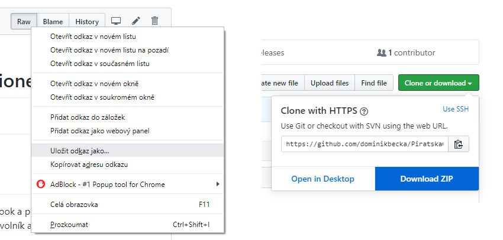
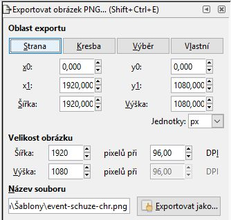

# Databáze grafických šablon pro Piráty v regionech
* [pro Facebook a Instagram](/facebook)
* pro tisk
## Co je tohle?
Databáze Pirátských grafik pro různé účely v SVG. Těžce ve vývoji.
## Proč to existuje?
U [Pirátů Pardubicko](https://pardubice.pirati.cz) cítíme opakovanou potřebu vyrábět covery, bannery, grafiky na facebook a podobně. Občas bychom ocenili i plakátky, cedulky a podobně. Na každou takovou věc musí vlítnout grafik – dobrovolník a:
* spálí mu to nějaký čas a síly, zvláště když vytváří několik verzí,
* může být moc kreativní a výsledek nemusí být konzistentní s grafickým manuálem a s dlouhodobou komunikací Pirátů
* a příště, anebo třeba hnedka zítra v jiným okrese, bude tu samou věc dělat někdo jiný zase od začátku.

Proto chceme vytvořit a postupně rozšiřovat **databázi grafických šablon pro regiony**.
### Proč to ještě neudělal někdo jiný?
Na centrální úrovni šablony samozřejmě existují. Veřejně je ale jen drobný chaos [ve složce Grafika](https://drive.google.com/drive/u/0/folders/1LiYgzzi0NpGHAEaxyUDSALQf5-kM8bqc), kde není všechno – a to, co tam je, má často zdroj v ai, pdf nebo psd, což pro laika není jednoduché zpracovat. Tahle stránka samozřejmě slouží i jako *proof of concept* k přebrání někým povolanějším.
## Jak stáhnout šablonu?
Ve složkách nahoře jsou náhledy. Klikni na něj a na stránce souboru klikni pravým tlačítkem myši na *Raw* a zvol *Uložit odkaz jako*.
Nebo si můžeš stáhnout všechno najednou zeleným čudlíkem *Clone or download* vpravo nahoře.

## Jak ji použít?
Potřebuješ mít dvě věci:
1. [Inkscape](https://inkscape.org/) (na Win, Mac i Linux, open-source; u jiných programů, které umí s SVG se přece jen může něco rozbít),
2. a fonty Bebas Neue a Roboto Condensed. Odkaz na ně najdeš hned nahoře [u grafického manuálu Pirátů](https://pirati.cz/download)

Potom by mělo stačit:
* otevřít soubor,
* poklikat na všechny texty, které potřebuju přepsat, a přepsat je,
* Ctrl+Shift+E, nebo Soubor/Exportovat obrázek PNG,
* ověřit, že pod Oblast exportu je zvoleno Strana,

* uložit hotový soubor a použít ho, jak je potřeba.

U jednoduchých věcí to zvládne každý a netrvá to ani pět minut.
## Co když se něco rozbije?
1. Ověř si, že máš aktuální Inkscape a nainstalované fonty Bebas Neue a Roboto Condensed. 
2. Napiš na dominik.becka@pirati.cz.
## Kdo tohle dělá?
[Dominik Bečka](https://pardubice.pirati.cz/clenove/dominik-becka/), člen Pirátů Pardubicko, s pomocí Krajského mediálního odboru [Pirátů Pardubického kraje](https://pardubicky.pirati.cz/).
## Jak se připojit?
Napiš na dominik.becka@pirati.cz.
